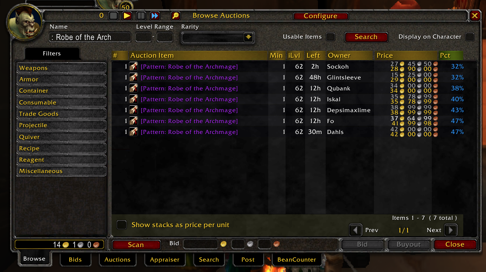

# Structure of the Auctioneer data

Inside the `ropes` object the structure of the items is as follows. It seems that the individual auctions are enclosed in curly bracers `{ ... }`. 

```
"return {
{\"|cffffffff|Hitem:8846::::::::80:::::::|h[Gromsblood]|h|r\",50,7,0,nil,350750,2,1579033390,\"Gromsblood\",nil,2,1,true,1,350750,0,510000,0,false,\"Kursad\",4,\"\",8846,0,0,0,0,},
{\"|cffffffff|Hitem:4306::::::::80:::::::|h[Silk Cloth]|h|r\",30,7,0,nil,2723,3,1579033390,\"Silk Cloth\",nil,12,1,true,1,2723,0,2723,0,false,\"Dankdave\",0,\"\",4306,0,0,0,0,},
{\"|cff0070dd|Hitem:13100::::::::80:::1::::|h[Furen's Boots]|h|r\",44,4,1,8,58131,3,1579033390,\"Furen's Boots\",nil,1,3,true,39,58131,0,70000,0,false,\"Whodps\",0,\"\",13100,0,0,0,0,},
{\"|cffffffff|Hitem:6149::::::::80:::::::|h[Greater Mana Potion]|h|r\",41,0,0,nil,10900,3,1579033390,\"Greater Mana Potion\",nil,5,1,true,31,10900,0,12200,0,false,\"Jäegarn\",4,\"\",6149,0,0,0,0,},
{\"|cffffffff|Hitem:6149::::::::80:::::::|h[Greater Mana Potion]|h|r\",41,0,0,nil,10900,3,1579033390,\"Greater Mana Potion\",nil,5,1,true,31,10900,0,12200,0,false,\"Jäegarn\",4,\"\",6149,0,0,0,0,},
{\"|cffffffff|Hitem:6149::::::::80:::::::|h[Greater Mana Potion]|h|r\",41,0,0,nil,10900,3,1579033390,\"Greater Mana Potion\",nil,5,1,true,31,10900,0,12200,0,false,\"Jäegarn\",4,\"\",6149,0,0,0,0,},
```

## Real life example



```lua
{
    \"|cffa335ee|Hitem:14513::::::::80:::1::::|h[Pattern: Robe of the Archmage]|h|r\", -- item string
    62, -- iLvl
    9,
    2,
    nil,
    420000,
    1,
    1579628374,
    \"Pattern: Robe of the Archmage\", -- item name
    nil,
    1,
    4,
    false,
    1, -- min level 
    420000, -- bid
    0,
    420000, -- buyout
    0,false,
    \"Dahls\", -- Owner
    0,
    \"\",
    14513, -- item ID, see https://classic.wowhead.com/item=14513/pattern-robe-of-the-archmage
    0,
    0,
    0,
    0,
}
```

```lua
{
    \"|cffffffff|Hitem:17200::::::::80:::14::::|h[Recipe: Gingerbread Cookie]|h|r\",
    5,
    9,
    5,
    nil,
    23853,
    4, -- this one is 48hr 
    1579628376,
    \"Recipe: Gingerbread Cookie\", name
    nil,
    1,
    1,
    false,
    1,
    23853, -- min price expressed in coppers
    0,
    24094, -- buyout expressed in coppers
    0,
    false,
    \"Pantéra\",
    0,
    \"\",
    17200, -- item ID 
    0,
    0,
    0,
    0,
}
```

This is the other gingerbread cookie with 2h hours left

```lua
{
    \"|cffffffff|Hitem:17200::::::::80:::14::::|h[Recipe: Gingerbread Cookie]|h|r\",
    5,
    9,
    5,
    nil,
    23500,
    3, -- this one is 2hrs 
    1579628374, -- timestamp 
    \"Recipe: Gingerbread Cookie\",
    nil,
    1,
    1,
    false,
    1,
    23500,
    0,
    23500,
    0,
    false,
    \"Bankamatsa\",
    0,
    \"\",
    17200,
    0,
    0,
    0,
    0,
}
```

"(almost) impossible since the server only returns an integer refering to short, medium, long and very long. so until you keep track of all auctions and are lucky to find the moment when this information changes, there'll be no way..."

https://www.wowinterface.com/forums/showthread.php?t=2602


Time left on the auction:
1. Short - Less than 30 minutes.
2. Medium - Between 30 minutes and 2 hours.
3. Long - Between 2 hours and 12 hours.
4. Very Long - Between 12 hours and 48 hours.

https://wow.gamepedia.com/Auction_House

## Timestamp! 

I found out that `1579628375` is always the same, then it dawned on me this
might be a timestamp.

And converting this is like ... 

## Resources

* [lua-users.org](http://lua-users.org/wiki/JsonModules)
* [luarocks](https://github.com/luarocks/luarocks/wiki/Using-LuaRocks)

## Questions that I've Googled

* "import variable lua from another file"
* "lua variables import other file"
* "require returns boolean"
* "save lua to file"
* "shell prepend file" 
* "prepend text to file python"